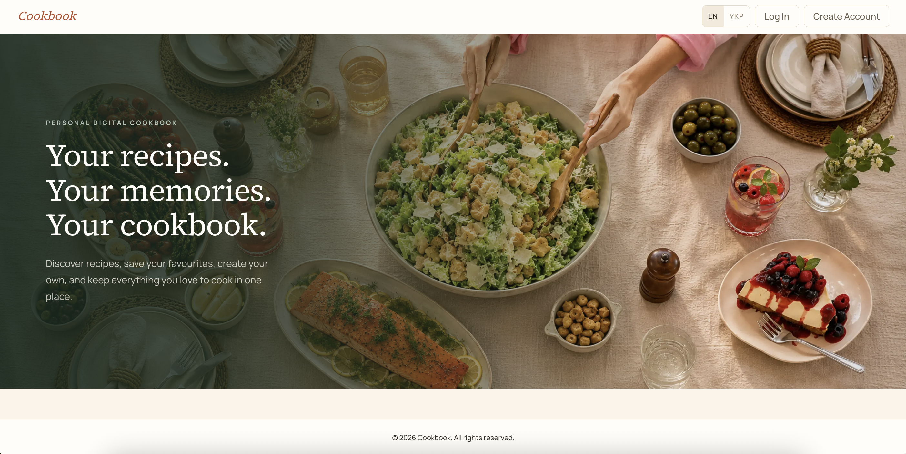

# Cookbook

A personal digital cookbook: discover recipes, save favourites, create your own, and keep everything you love to cook in one place.

Plan menus for events and for the week — the app automatically builds a shopping list.



## Features

- Recipes: browse, favourites, and create your own
- Menus for events and for the week
- Automatic shopping list generation
- Authentication (log in / sign up)
- Two UI languages: English and Ukrainian

## Interface language

- English (`EN`)
- Ukrainian (`УКР`)

The language switcher is available in the app header.

## Tech stack

| Layer | Stack |
|---|---|
| Frontend | React 19, TypeScript, Vite, TanStack Router, TanStack Query, Tailwind CSS, React Hook Form, Zod, i18next |
| Backend | NestJS, TypeScript, Prisma, Zod, JWT (auth), Swagger |
| Infrastructure | Docker Compose, PostgreSQL, Redis, MinIO (S3-compatible storage) |

## Prerequisites

- [Docker Desktop](https://www.docker.com/products/docker-desktop/) — must be running (green status)
- Node.js + npm
- A `.env` file in the project root:

```bash
cp .env.example .env
```

Fill in your passwords/secrets in `.env`. Backend env is also loaded from `backend/environments/local.env`.

---

## Local setup (step by step)

All Docker commands run from the **repo root**. Backend and frontend should run in separate terminals.

### Step 1. Docker (Postgres, Redis, MinIO)

```bash
# Postgres only (enough for Prisma Studio)
docker compose -f docker-compose.yml -f docker-compose.dev.yml up -d db

# Full backend stack — also Redis and MinIO
docker compose -f docker-compose.yml -f docker-compose.dev.yml up -d db redis minio
```

Check status:

```bash
docker compose -f docker-compose.yml -f docker-compose.dev.yml ps
```

Stop containers:

```bash
docker compose -f docker-compose.yml -f docker-compose.dev.yml stop
```

### Step 2. Backend

```bash
cd backend
npm install
npm run prisma:migrate:deploy   # apply migrations (first time / after pull)
npm run prisma:seed             # optional: demo data
npm run start:dev
```

After start:

| What | URL |
|---|---|
| API | http://localhost:3000 |
| Swagger | http://localhost:3000/docs |

#### Prisma Studio (optional)

Make sure `db` is running in Docker first:

```bash
cd backend
npm run prisma:studio
```

- Prisma Studio: http://localhost:5555

### Step 3. Frontend

```bash
cd fe
npm install
npm run dev
```

- Frontend: http://localhost:5173

---

## Quick checklist

1. Start Docker Desktop  
2. `docker compose -f docker-compose.yml -f docker-compose.dev.yml up -d db redis minio`  
3. `cd backend && npm install && npm run prisma:migrate:deploy && npm run start:dev` → http://localhost:3000/docs  
4. `cd fe && npm install && npm run dev` → http://localhost:5173  
5. (optional) `cd backend && npm run prisma:studio` → http://localhost:5555  

## Useful links

| What | URL |
|---|---|
| Frontend | http://localhost:5173 |
| API | http://localhost:3000 |
| Swagger | http://localhost:3000/docs |
| Prisma Studio | http://localhost:5555 |
